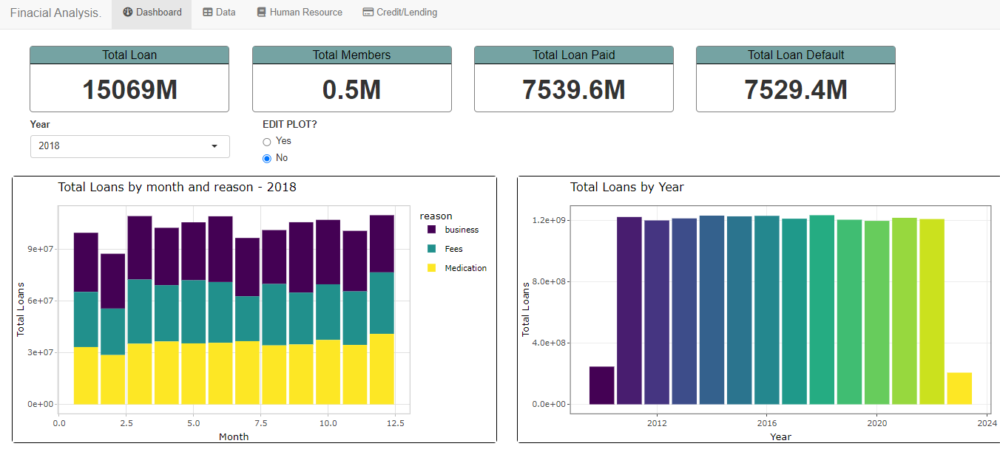

# shiny Projects
Shiny Projects
1. Flights

    **Case Study**: How does weather influence Flight delays?.

    

2. Cars

    **Case Study**: How to choose the most fuel consumption car?

    
    
3. finance

To replicate this project:-

    i. Run the `Data/Data.R` file to generate the data.
    ii.Run the App.R file

    **Case Study**: Manage finances of an organisation

    